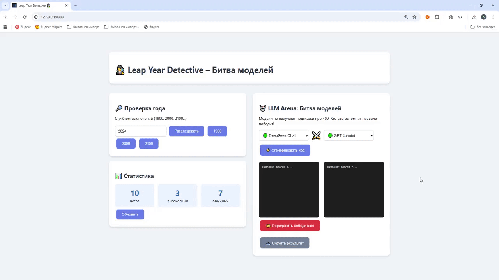
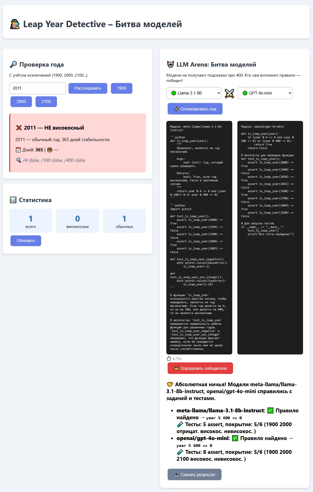
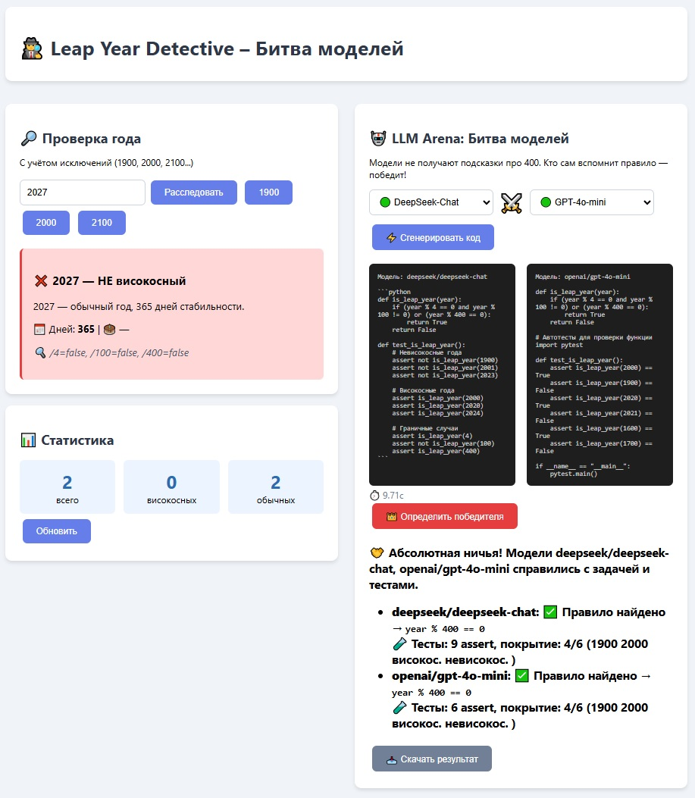
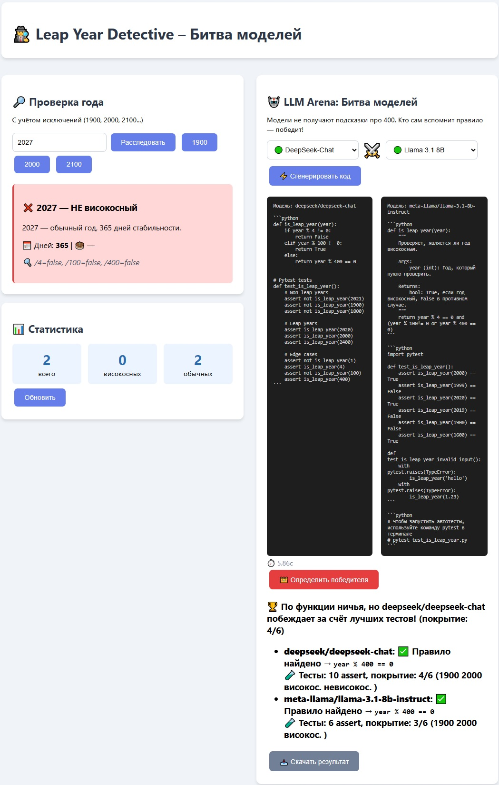
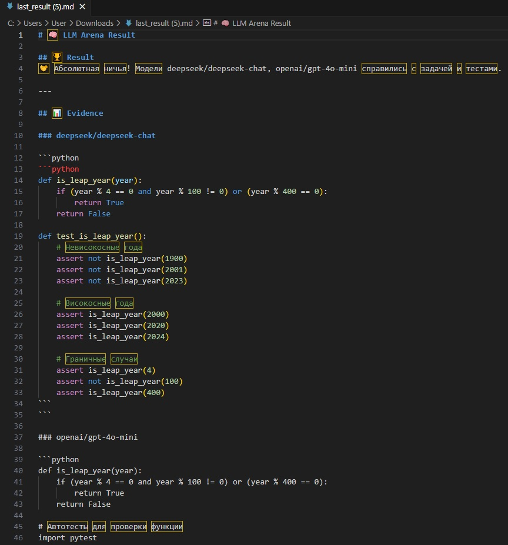

# 🕵️ Leap Year Detective – The Battle of the Models

**Leap Year Detective** — это интерактивное веб-приложение на FastAPI, которое объединяет две мощные функции:

[](https://codecov.io/gh/AleKolar/Leap-Year-Detective-The-Battle-of-the-Models)


1. **Детектив високосного года** – проверяет любой год с учётом всех исторических правил григорианского календаря.
2. **LLM Arena** – арена для сравнения больших языковых моделей (LLM), где они **без подсказок** пытаются реализовать функцию `is_leap_year` и написать к ней тесты.

Победитель определяется автоматически: рефери проверяет, знает ли модель исключение «годы, кратные 400», а при ничьей анализирует качество написанных тестов.

## 📊 CI / Coverage

Проект использует **GitHub Actions CI**, который автоматически:

- запускает тесты (`pytest`)
- считает coverage (`pytest-cov`)
- проверяет API и бизнес-логику
- валидирует LLM Arena (mocked OpenRouter)
- блокирует merge при падении тестов

### 🔧 CI включает:

- 🧪 unit + integration tests  
- 🤖 mocked LLM API  
- 🗄️ mocked Async DB (SQLAlchemy)  
- 📊 coverage report  
- ⚡ запуск на push и PR  

---

## 🧰 Tech Stack

- Python 3.12
- FastAPI
- SQLAlchemy Async
- SQLite
- Alembic (database migrations)
- aiohttp
- Jinja2
- Pytest
- Ruff
- GitHub Actions
- Codecov
- OpenRouter API

---

## 🏗️ Architecture

Проект использует layered architecture и придерживается принципа separation of concerns:

- routers → thin FastAPI HTTP/API controllers
- services → business logic and orchestration
- schemas → Pydantic request/response schemas (API contract layer)
- models/db_models.py → SQLAlchemy ORM models only
- database → async DB engine, session management, and Alembic migrations
- utils → formatting and normalization helpers
- tests → unit/integration tests with mocked infrastructure

## 📦 Что умеет проект

### 🔍 Детектив високосного года
- Проверка любого года на високосность с учётом правил:  
  * год делится на 4 **И** не делится на 100 **ИЛИ** делится на 400.
- Примеры исключений:  
  * 1900 – не високосный (делится на 100, но не на 400)  
  * 2000 – високосный (делится на 400)
- Красивое отображение результата, количества дней, знаменитостей, родившихся в этот год.
- Ведётся статистика всех проверок.

### 🤖 LLM Arena – битва моделей
- Выбор двух бесплатных моделей из OpenRouter (или добавление новых).
- Генерация кода функции `is_leap_year` и тестов к ней **без подсказки о правиле 400**.
- Автоматический судья:
  * Проверяет наличие условия `year % 400 == 0` в сгенерированном коде.
  * При ничьей анализирует **покрытие тестов** (ключевые года, граничные случаи, стиль).
- Отображение доказательств: найденный фрагмент кода, статистика по тестам.
- Сохранение результата последней битвы (без внешней БД, через `app.state`).

## 📥 📄 Экспорт результата битвы 

Есть функциональность для **скачивания результата последней LLM-битвы в удобном формате**.

### 🧠 Что это даёт

Можно получить готовый файл с результатами, который включает:

- победителя битвы
- код обеих моделей (winner + competitor)
- автотесты и их анализ
- судейское сообщение
- доказательства (`evidence`)
- временную метку создания

---

### 📄 Формат экспорта

Результат скачивается в виде **JSON-файла с красивым форматированием**:

```json
{
  "id": 23,
  "model1": "llama-3.1-8b",
  "model2": "llama-3.3-70b",
  "winner": "llama-3.1-8b-instruct",
  "message": "🏆 Победитель ...",
  "evidence": [
    {
      "model": "...",
      "content": "код + тесты",
      "status": "success"
    }
  ],
  "created_at": "2026-05-08T17:38:44"
}
```
# 🎬 Project Demo
<table align="center" border="2" bordercolor="#007bff" cellpadding="15" bgcolor="#f0f8ff">
  <tr><td>
    <h3>🎥 Live demo</h3>
    <p><i>Вот так это работает</i></p>
    
  </td></tr>
</table>

[](screenshots/walkthrough.mp4)

## 🧠 LLM Battle Results


<!--  -->


---

## 📄 Downloaded Result File Example



---

## 🧪 Автотесты (pytest)

Проект покрыт набором тестов, которые проверяют как бизнес-логику, так и API-слой FastAPI.

### 🔹 Unit-тесты (логика високосного года)

- Тестируется функция `is_leap_year`
- Проверяются:
  - обычные високосные годы (деление на 4)
  - исключения (1900, 1800, 2100)
  - правило 400 (2000 как ключевой кейс)
  - граничные и нетипичные значения

👉 Цель: гарантировать корректность календарной логики без зависимости от API и БД.

---

### 🔹 API-тесты (FastAPI endpoints)

Используется `TestClient(FastAPI app)` для проверки HTTP-слоя:

- `/api/check/{year}` — проверка года
- `/api/stats` — статистика запросов
- `/` — главная HTML-страница

👉 Проверяется:
- корректность JSON-ответов
- HTTP статус-коды
- структура response payload

---

### 🔹 LLM Arena тесты (интеграционные)

Тестируется логика сравнения моделей:

- `/api/llm-arena/compare`
- `/api/llm-arena/models`
- `/api/llm-arena/winner`

#### Особенности:
- используется `unittest.mock.patch` для подмены OpenRouter API
- ответы моделей симулируются через `side_effect`
- проверяется:
  - количество результатов
  - структура ответа
  - наличие победителя/проигравшего
  - корректность обработки evidence

---

### 🔹 Мокирование базы данных (AsyncSession)

Все тесты изолированы от реальной БД:

- `get_async_db` переопределяется через `app.dependency_overrides`
- используется `AsyncMock` для:
  - `execute`
  - `commit`
  - `refresh`
- `MagicMock` используется для синхронных операций (`add`)

👉 Важно: FastAPI вызывает dependency на каждый запрос, поэтому mock-сессия создаётся внутри override-функции, чтобы каждый тест получал новый корректно настроенный экземпляр.

👉 Это обеспечивает:
- изоляцию от SQLite / SQLAlchemy engine
- стабильность CI пайплайна
- отсутствие побочных эффектов между тестами

---

### 🧠 Стратегия тестирования

| Уровень | Что проверяется |
|--------|----------------|
| Unit | бизнес-логика (leap year rules) |
| Schema | Pydantic модели (валидация вход/выход, API контракт) |
| API | FastAPI endpoints |
| Integration | LLM Arena + mocked OpenRouter |
| Infrastructure mock | Async DB session |

### 🚀 Запуск тестов

```bash
pytest src/tests -v
```

---

## 🧠 Как это работает

### Проверка года
Эндпоинт `/api/check/{year}` принимает целое число и возвращает JSON с вердиктом, описанием и статистикой. Вся логика вынесена в слой сервисов (`services/leap_year_service.py`).

### Арена LLM
1. Пользователь выбирает две модели в веб-интерфейсе.
2. Запрос уходит на `/api/llm-arena/compare`, где сервер параллельно обращается к OpenRouter API.
3. OpenRouter возвращает сгенерированный код от каждой модели.
4. Результаты сохраняются в базе данных SQLite (модель `ArenaResult`).
5. По нажатию «Определить победителя» фронтенд запрашивает `/api/llm-arena/winner`.
6. Судья (`judge_winner` в `ai_service.py`) проверяет код и возвращает вердикт вместе с доказательствами.

### Оценка тестов
Если обе модели написали правильную функцию, судья сравнивает:
- **Количество assert'ов**
- **Покрытие ключевых случаев** (1900, 2000, 2100, отрицательные года, типичный високосный/невисокосный)
- **Стиль** – наличие сообщений в assert'ах

---

## 🛠️ Расширение списка моделей

Вы легко можете добавить новые бесплатные модели.


### 1. Добавьте модель в словарь `AVAILABLE_MODELS`  
Файл: `src/services/ai_service.py`

```python
AVAILABLE_MODELS = {
    "gpt-4o-mini": "openai/gpt-4o-mini",
    "deepseek-chat": "deepseek/deepseek-chat",
    # ... существующие модели ...
    "новая-модель": "полный/идентификатор/модели:free",   # <-- Заменить на актуальную модель
}

```
### 2. Обновите выпадающие списки в шаблоне  
Файл: `src/templates/index.html`

Внутри `<select id="model1">` и `<select id="model2">` добавьте новую опцию:

```html
<option value="ваш-ключ">🟡 Название модели</option>
```

> **Важно:** Для бесплатных моделей ID должен заканчиваться на `:free`.  
> Актуальный список можно получить через [OpenRouter API](https://openrouter.ai/api/v1/models?free=true) или на [сайте](https://openrouter.ai/models?q=free).

---

## 🚀 Быстрый старт

### 1. Клонирование репозитория
```bash
git clone https://github.com/your-username/Leap-Year-Detective.git
cd Leap-Year-Detective
```

### 2. Настройка окружения
Создайте виртуальное окружение (рекомендуется Python 3.10+):
```bash
python -m venv .venv
source .venv/bin/activate   # Linux/macOS
.venv\Scripts\activate      # Windows
```

Установите зависимости:
```bash
pip install -r requirements.txt
```

### 3. Получение и настройка API-ключа OpenRouter
- Зарегистрируйтесь на [OpenRouter](https://openrouter.ai) и получите API-ключ.
- Создайте файл `.env` в корне проекта (он уже в `.gitignore`):
  ```
  OPENROUTER_API_KEY=sk-or-v1-ваш-ключ
  ```

### 4. Запуск сервера
```bash
uvicorn main:app --reload
```
Откройте в браузере [http://127.0.0.1:8000](http://127.0.0.1:8000).

### 5. Запуск тестов
```bash
pytest src/tests/test_main.py -v 
 
pytest --cov=src --cov-report=term-missing # с покрытием
```

---

## 📁 Структура проекта

```
text
Leap-Year-Detective/
├── .env
├── .gitignore
├── pyproject.toml          # ⚙️ Конфигурация Ruff / Pytest / Coverage
├── requirements.txt
├── main.py                    # Точка входа, lifespan, шаблоны
├── alembic.ini                # Конфигурация Alembic
├── alembic/                   # Миграции
│   ├── env.py
│   └── versions/
├── src/
│   ├── routers/
│   │   ├── leap_year.py       # Эндпоинты проверки года
│   │   └── llm_arena.py       # Эндпоинты арены LLM (асинхронная БД)
│   ├── services/
│   │   ├── leap_year_service.py  # Бизнес-логика високосного года
│   │   ├── ai_service.py         # OpenRouter, сравнение, судья
│   │   └── arena_result.py       # 🔥 Работа с результатом последней битвы (DB service)
│   ├── models/
│   │   ├── models.py          # Pydantic-схемы (legacy / internal models)
│   │   └── db_models.py       # SQLAlchemy ORM модели (ArenaResult и др.)
│   ├── schemas/
│   │   └── schemas.py         # Pydantic схемы (request/response слой API)
│   ├── database/
│   │   └── database.py        # Асинхронный движок, сессии, Alembic support
│   ├── utils/
│   │   └── normalize.py      # 🔧 normalize_evidence (переносы, форматирование)
│   ├── templates/
│   │   └── index.html
│   ├── static/                # favicon.ico
│   └── tests/
│       └── test_main.py
└── README.md
```

---

## 💡 Нюансы

- **База данных SQLite** – результаты арены сохраняются в файле `arena_history.db`, история не пропадает при перезапуске.
- **Асинхронная работа с БД** – все эндпоинты арены используют асинхронные сессии SQLAlchemy (`AsyncSession` + `aiosqlite`). Синхронный движок оставлен только для миграций Alembic.
- **Статистика проверок годов** хранится в глобальной переменной (сбрасывается при рестарте). Для продакшена можно перенести в БД.
- **Бесплатные модели OpenRouter** могут менять свои ID; при ошибках 422/404 проверьте актуальность идентификатора в `AVAILABLE_MODELS`.
- **Lifespan** управляет `aiohttp.ClientSession` и выполняет проверку доступности OpenRouter и БД при старте.
- **Судья** определяет правило через регулярное выражение; если модель напишет `not year % 400` или `year % 400 == 0` – правило засчитывается.

---

## 📝 Лицензия

MIT License – делайте что угодно, сохраняя оригинальное авторство.

**Спасибо за использование Leap Year Detective!**  
Удачи на арене моделей! 🤖⚔️